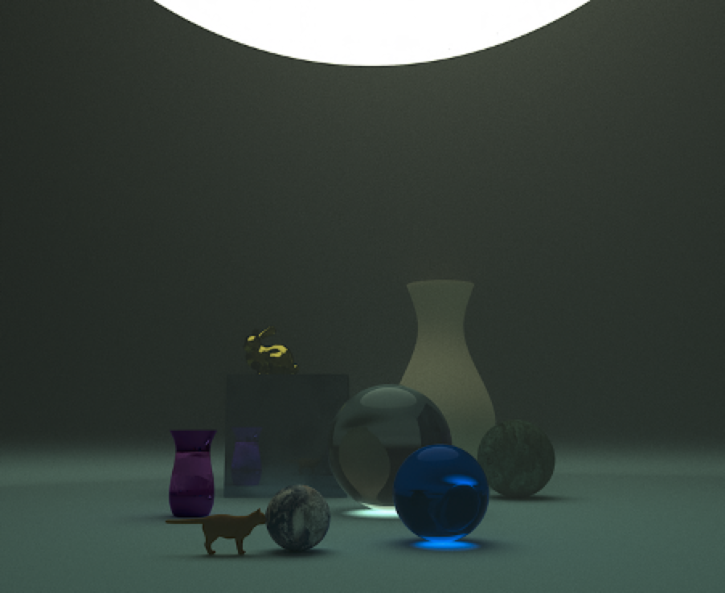

# mini_renderer
Computer Graphics THU CST

---

## 实现功能

1) 基本功能（25）：实现支持漫反射、高光、反射与折射和支持三角网格模型导入的光线追踪（和path tracing）模型；

2) 实现渐进式光子映射（Progressive Photon Mapping,PPM）算法（10）；

3) 一些功能（10）:景深、软阴影、抗锯齿与纹理贴图；

4) 实现Bezier旋转曲面造型与解析法求交（10）；

5) 光线求交加速（5）:包括三角面片的八叉树与包围盒加速、PPM存储碰撞点的KDTree以及Bezier求交的包围盒加速三方面；

6) 额外功能（？）：基于Henyey-Greenstein's phase function模拟体积光、基于Perlin Noise模拟物体表面的噪声效果。

---

## 运行

次实验的起始代码主要基于PA1的代码框架，除复用Vecmath库进行向量操作以外，主要还应用了image.hpp/cpp进行图像访存、mesh.hpp/cpp（有修改、增补）进行三角网格的预处理和scene_parser.hpp/cpp（有修改、增补）进行场景读取。

按照PA1的习惯，大多数实现直接写在了include文件夹中的hpp文件中，少部分功能较多、实现麻烦的方法于src文件夹中的cpp文件进行实现。在textcases文件夹下存放了测试样例。

~~~bash
bash ./run_all.sh
~~~

---

## 效果

有体积光的效果：

